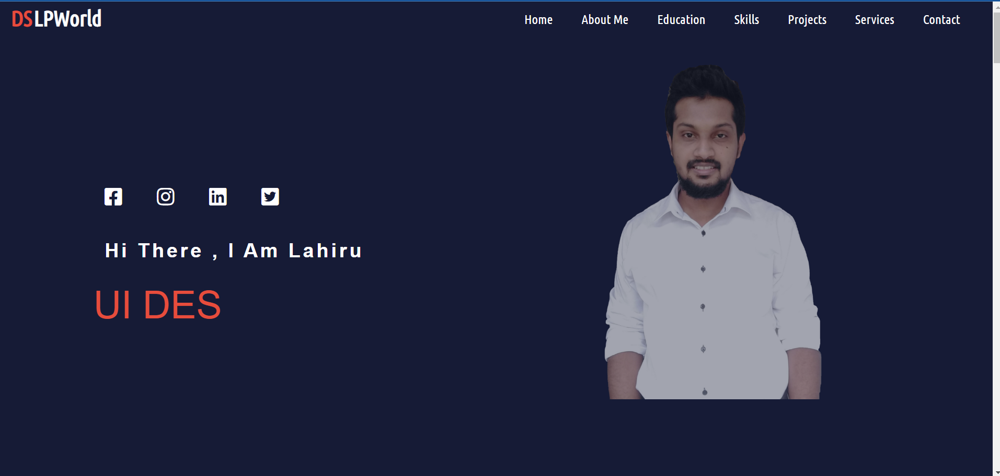
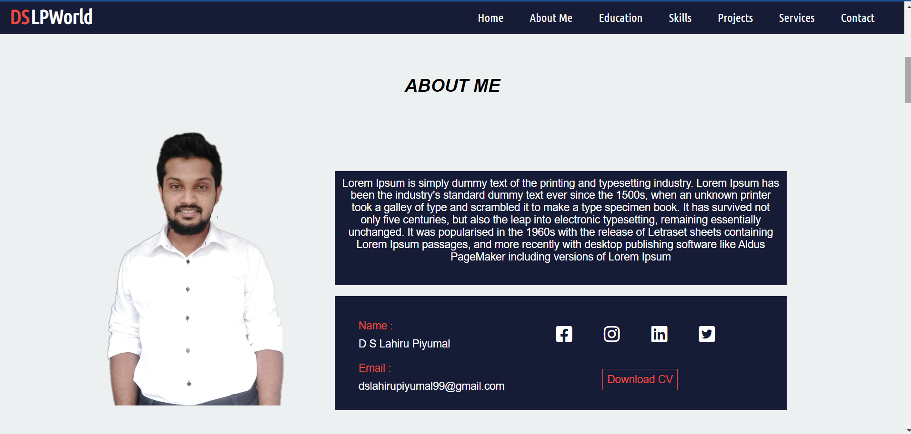
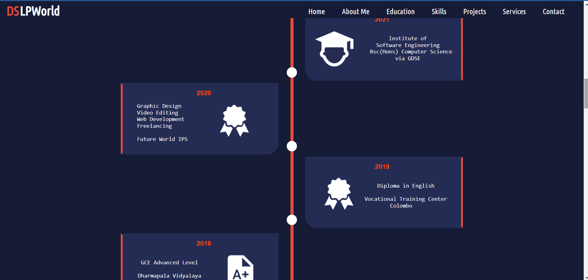
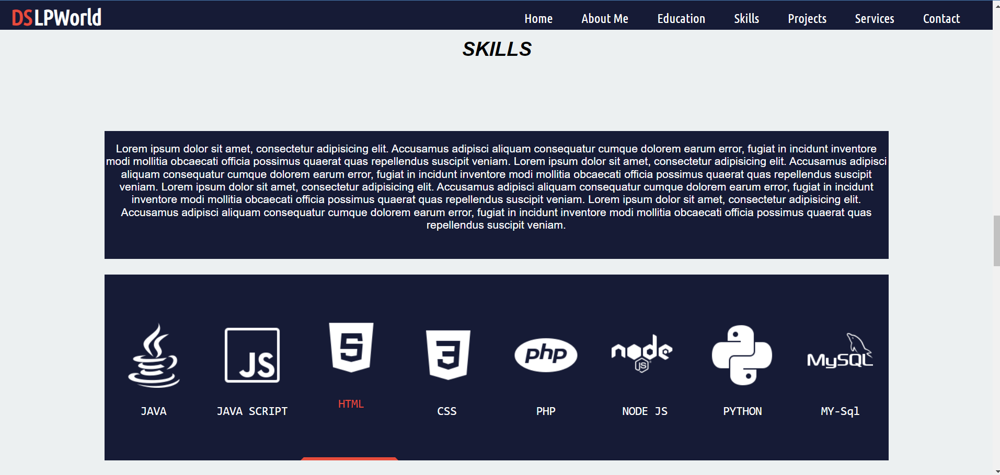
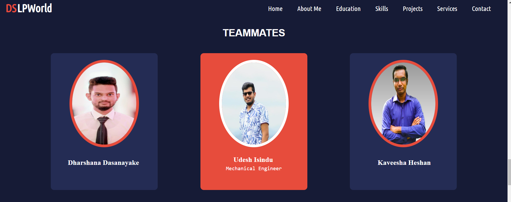
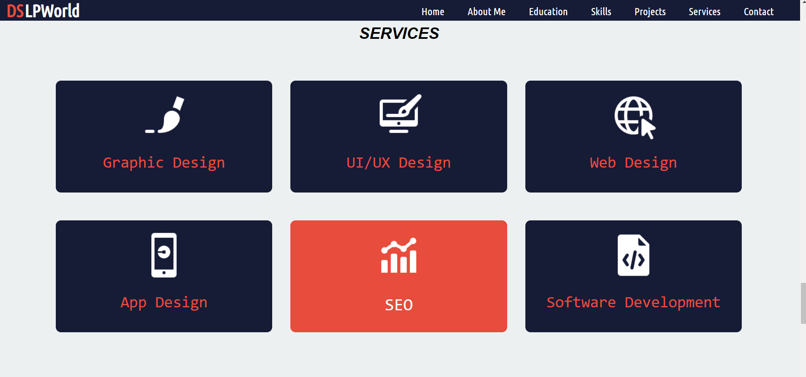
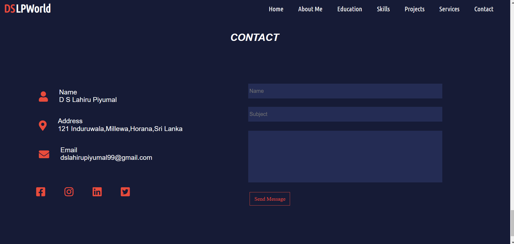

## DSLPWorld

This is my first website. This will get my information through and is designed for an assignment at IJSE.

## Screenshots

### 01

### 02

### 03

### 04

### 05

### 06

### 07

### Use the links below to learn more about my profile.

- To check the [Site Map](https://www.gloomaps.com/HirsvElb7r)
- To check the [wireframe](https://wireframe.cc/rGQ2SU)
- To check the [mockup](https://www.figma.com/file/e5cTGQrNSXC3bGrxtjBX1G/Untitled?node-id=0%3A1)
- To check the [Github Site](https://dlp-sekara.github.io/DSLPWorld/)
- To check the [000Webhost](https://dslpworld.000webhostapp.com)